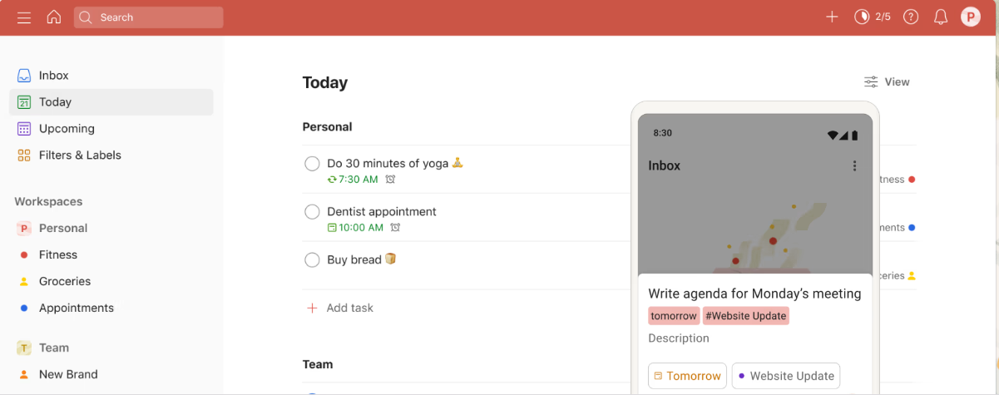
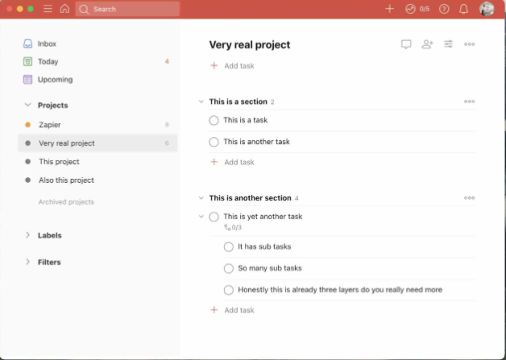
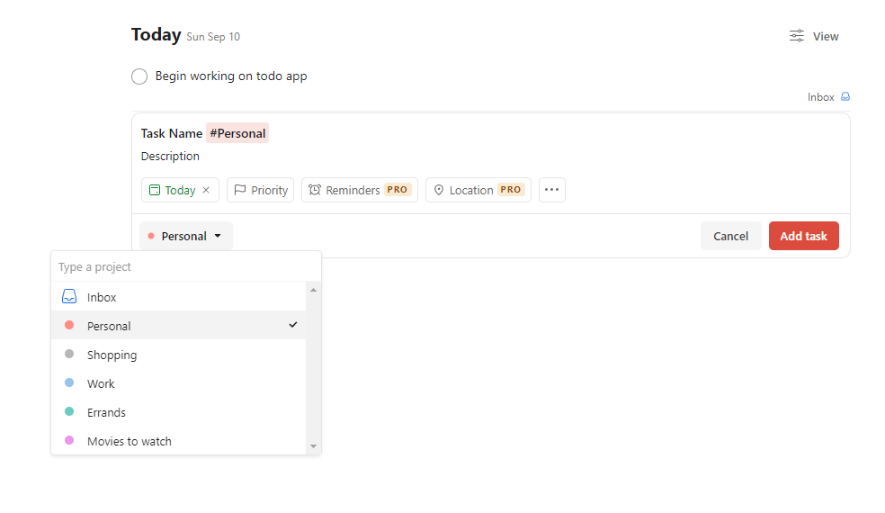
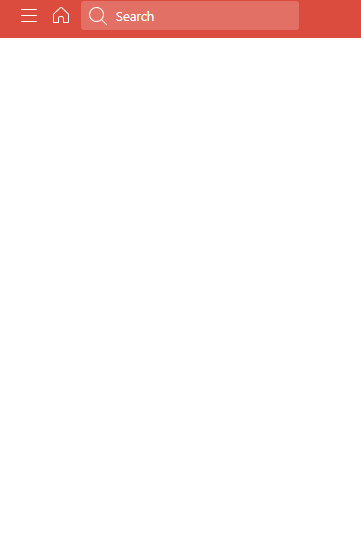

# Goal

The goal of this project is to work on HTML, CSS, and basic JS. Because our long term goal is to build out our own Todo App, we shall be attempting to create a clone of a popular, simple todo list application.

Below are a couple of screenshots of the [Todoist app](https://todoist.com/). We will be using this as a basic template from which to build out a static webpage.

Example of Adding a Task

The left side bar is the "menu". When it's closed it's blank.

